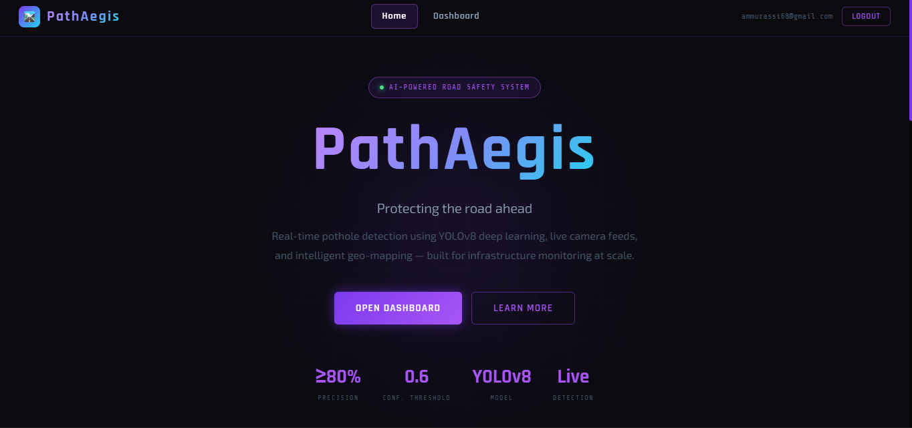
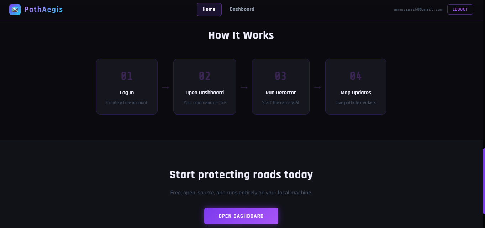

<div align="center">

# 🚗 PathAegis — AI Road Intelligence & Pothole Detection System

🌐 **Real-time pothole detection · Crowd-sourced road monitoring · Smart analytics dashboard**
## 🌐 Live Deployment-[🛣️ Visit PathAegis](https://path-aegis.vercel.app/)


### AI-powered smart road monitoring platform using YOLOv8, OpenCV & real-time geospatial analytics.

</div>

---

# 📌 Overview

**PathAegis** is an AI-powered intelligent road monitoring system designed to detect potholes in real-time using Computer Vision and Deep Learning.

The platform leverages a custom-trained **YOLOv8 object detection model** integrated with OpenCV to identify potholes through webcam or live camera feeds. Each detection is logged with GPS coordinates, severity level, and confidence score to a Flask backend and visualized on an interactive dashboard powered by Leaflet and OpenStreetMap.

The system combines:

- 🤖 YOLOv8-based pothole detection
- 📍 GPS-enabled geospatial mapping
- 🧠 Real-time severity analysis
- 🌐 Interactive road intelligence dashboard
- 📊 Crowd-sourced pothole database
- ⚡ Live monitoring and analytics

---

# ✨ Features

## 🤖 AI Detection System

- Real-time pothole detection using YOLOv8
- OpenCV-powered live webcam processing
- Bounding box visualization
- Confidence score analysis
- Automatic severity classification

---

## 🗺️ Smart Mapping System

- Live pothole plotting on map
- OpenStreetMap integration
- Real-time marker updates
- GPS-based road intelligence
- Crowd-sourced road condition tracking

---

## 📊 Analytics Dashboard

- Dark-themed responsive dashboard
- Severity statistics visualization
- Detection count monitoring
- Live polling system
- Interactive pothole tables

---

## 🔐 Authentication System

- Secure token-based authentication
- User registration and login
- Protected dashboard access
- Persistent user sessions

---

## ⚡ Platform Features

- REST API architecture
- Docker containerization
- Real-time frontend updates
- Cloud-ready deployment structure
- Multi-service modular architecture

---

# 📸 Screenshots




---



---


---


## 🔐 Authentication System


---

# 🧠 AI & ML Concepts Used

- YOLOv8 Object Detection
- Computer Vision
- OpenCV Image Processing
- Real-Time Video Processing
- Bounding Box Classification
- Severity Prediction
- Spatial Data Analysis
- Geolocation Mapping

---

# 🏗️ System Architecture

```bash
┌─────────────────┐     ┌──────────────────┐     ┌─────────────────┐
│   Frontend      │────▶│   Backend        │────▶│   ML Engine     │
│  React + Vite   │     │  Flask REST API  │     │ YOLOv8 + OpenCV │
│  Tailwind CSS   │◀────│  SQLite DB       │◀────│ Webcam Detection│
│  Leaflet Maps   │     │  Auth System     │     │ Real-time CV    │
└─────────────────┘     └──────────────────┘     └─────────────────┘
```

---

# 🛠️ Tech Stack

| Layer | Technology |
|---|---|
| Frontend | React.js, Vite, Tailwind CSS |
| Backend | Flask, Flask-CORS |
| AI/ML | YOLOv8, OpenCV |
| Database | SQLite |
| Maps | Leaflet, OpenStreetMap |
| Authentication | Token-based Authentication |
| Containerization | Docker |
| Deployment | Docker Compose |

---

# ⚡ Quick Start

## Clone Repository

```bash
git clone https://github.com/your-username/PathAegis.git
cd PathAegis
```

---

## 1️⃣ Backend Setup

```bash
cd backend

python -m venv venv

# Windows
venv\Scripts\activate

pip install -r requirements.txt

python app.py
```

---

## 2️⃣ Frontend Setup

```bash
cd frontend

npm install
npm run dev
```

---

## 3️⃣ ML Detection Setup

```bash
cd ml

pip install -r requirements.txt

python detect.py --model best.pt --backend http://localhost:5000
```

---

## 4️⃣ Docker Setup

```bash
docker-compose up --build
```

---

# 📂 Project Structure

```bash
PathAegis/
│
├── backend/
├── frontend/
├── ml/
├── screenshots/
├── docker-compose.yml
└── README.md
```

---

# 📡 API Endpoints

| Method | Endpoint | Purpose |
|---|---|---|
| POST | /register | User Registration |
| POST | /login | User Authentication |
| POST | /pothole | Store pothole detection |
| GET | /potholes | Retrieve pothole records |
| GET | /stats | Detection statistics |
| GET | /health | API health check |

---

# 🎯 Severity Classification

| Severity | Detection Area |
|---|---|
| 🟢 Low | < 2% |
| 🟡 Medium | 2% – 7% |
| 🔴 High | > 7% |

---

# 🔒 Security Features

- Token-based authentication
- Protected API routes
- Secure backend communication
- Persistent database storage
- CORS protection

---

# 🔮 Future Enhancements

- 📱 Mobile application integration
- 🚘 Vehicle-mounted live detection
- ☁️ Cloud-based analytics platform
- 🧠 Advanced road damage classification
- 📡 IoT sensor integration
- 🛰️ Smart city infrastructure support

---

# 👩‍💻 Author

## Pavithra Sunilkumar

- LinkedIn: https://linkedin.com/in/pavithra-sunilkumar68
- GitHub: https://github.com/pavithrasunilkumar
- Portfolio: https://vermillion-panda-a08876.netlify.app/

---

# ⭐ Support

If you found this project useful, consider giving it a ⭐ on GitHub.

---

# ⚠️ License

This project is intended for educational and research purposes only.

---
